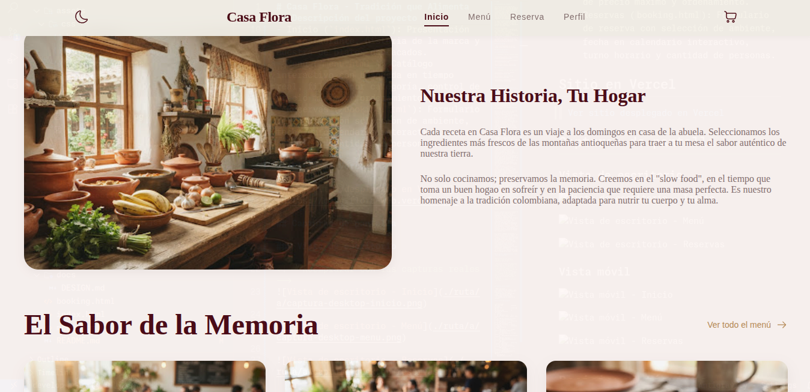
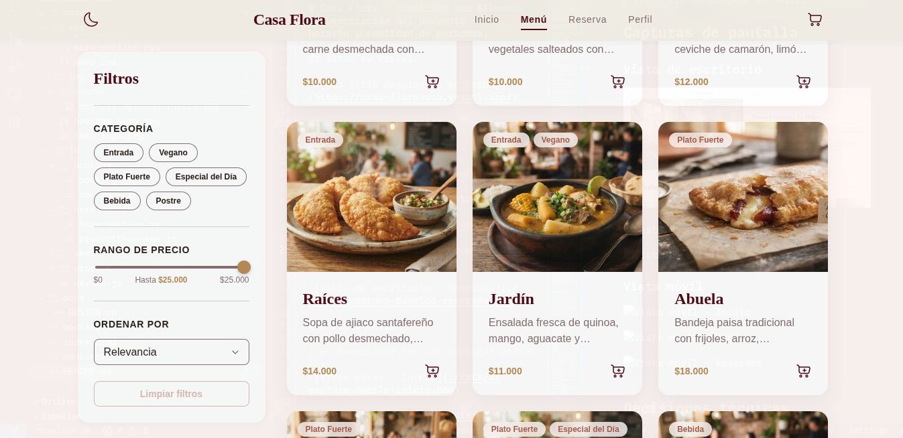
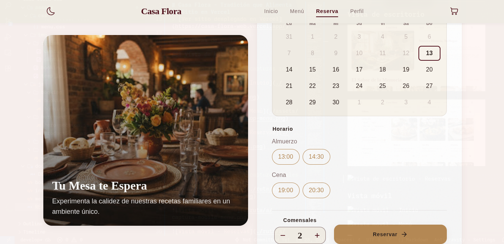
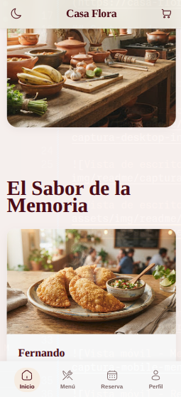
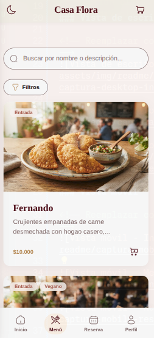
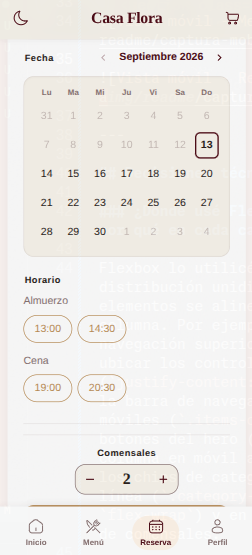

# Casa Flora - Tradición que Alimenta el Alma

## Descripción del proyecto

Casa Flora es el sitio web de una cocina oculta (dark kitchen) ubicada en Medellín, Colombia, enfocada en comida típica casera con opciones saludables. El proyecto busca ofrecer una plataforma propia donde los clientes puedan consultar el menú completo con precios actualizados, filtrar platos según sus preferencias y gestionar reservas de mesa desde el celular o el computador, sin intermediarios.

El sitio fue desarrollado completamente con HTML5, CSS3 y JavaScript vanilla, sin utilizar frameworks ni librerías externas para garantizar un rendimiento óptimo y una carga rápida.

Estructura de páginas:
- Inicio (`index.html`): Presentación del restaurante, historia de la marca y muestra de platos destacados.
- Menú (`menu.html`): Catálogo interactivo con búsqueda en tiempo real, filtros por categoría, control de precio máximo y ordenamiento.
- Reservas (`booking.html`): Formulario de reserva con selección de ambiente, fecha en calendario interactivo, turno horario y cantidad de personas.

## Sitio en Vercel

> [Ver sitio desplegado en Vercel](https://casa-flora-web.vercel.app/)

## Capturas de pantalla

### Vista de escritorio

<!-- Reemplazar con las capturas reales -->






### Vista móvil

<!-- Reemplazar con las capturas reales -->






---

## Decisiones técnicas

### ¿Dónde usé Flexbox y dónde Grid, y por qué en cada caso?

Flexbox lo utilicé para componentes con distribución unidimensional donde los elementos se alinean en una sola fila o columna. Por ejemplo, en la barra de navegación superior (`.navbar`) para ubicar los controles en los extremos (`justify-content: space-between`), en la barra de navegación inferior para móviles (`.items-container`), en los botones del hero (que cambian de columna en móvil a fila en tablet), en los chips de categorías con salto de línea (`.category-pills` con `flex-wrap`) y en el control numérico de comensales.

CSS Grid lo reservé para las secciones bidimensionales donde necesitaba organizar filas y columnas en simultáneo. Destacan el pie de página (`.footer-grid`), que pasa de 1 columna en móvil a 2 en tablet y 4 en escritorio; la grilla de productos (`.products-grid`), que reparte las tarjetas en 1, 2 o 3 columnas según el ancho de la pantalla; el calendario de reservas (`.calendar-grid`), que requiere una matriz estricta de 7 columnas; y la sección de historia, donde uso dos columnas en escritorio para alternar imagen y texto mediante la propiedad `order`.

### ¿Qué hace mi JavaScript?

El código JavaScript está organizado modularmente por responsabilidades:

- Navegación y modo oscuro (`navbar.js`): Guarda la preferencia de tema en `localStorage`, conmuta la clase `dark` en el elemento raíz y aplica una transición suave mediante la View Transitions API cuando el navegador lo soporta. También detecta el tamaño de ventana para inyectar los enlaces horizontales en pantallas de escritorio o retirarlos en móvil.
- Catálogo y filtros (`menu.js`): Controla el estado activo de los filtros (categorías, precio tope, ordenamiento y término de búsqueda). Al interactuar con los controles, recalcula la lista filtrada (usando un debounce de 300 ms en el buscador de texto), genera las etiquetas de filtros activos para poder eliminarlas individualmente y vuelve a dibujar las tarjetas en pantalla. En móvil, gestiona además el comportamiento del panel lateral deslizable y el bloqueo del scroll.
- Modelo de datos (`product.js` y `products.js`): Define la clase `Product` con sus métodos de acceso para estandarizar los datos de cada plato (nombre, precio, categorías, descripción e imagen) y provee la lista central de productos que consumen el menú y la portada.
- Vitrina de inicio (`productShowcase.js`): Selecciona los primeros platos del catálogo e inserta dinámicamente sus tarjetas en la página principal reutilizando la misma estructura visual.
- Calendario de reservas (`booking.js`): Genera la cuadrícula del mes en curso, ajusta el día inicial según el día de la semana, deshabilita fechas pasadas, permite navegar a meses futuros y limita el contador de comensales entre 1 y 10 personas.
- Validación del formulario (`bookingForm.js`): Al enviar la reserva, comprueba que se hayan elegido ambiente, fecha, turno y comensales. Si falta algún campo, resalta la sección en rojo, reproduce una animación de vibración, inserta el mensaje de error correspondiente y hace scroll suave hasta el primer problema detectado. Para limpiar los errores a medida que el usuario responde, escucha cambios en los botones de opción y vigila la selección en el calendario mediante un `MutationObserver`.

### ¿Qué fue lo más difícil y cómo lo resolví?

El mayor reto fue construir el panel de filtros del menú para que en móvil funcionara como un menú lateral desplegable (drawer) con animación y fondo oscuro, mientras que en escritorio se comportara como una barra lateral fija (`position: sticky`) al lado de la grilla de platos, todo compartiendo el mismo HTML. Lo solucioné combinando media queries en CSS: a partir de 768px, el contenedor principal pasa a `display: flex`, el panel abandona la posición `fixed` para volverse `sticky`, y los elementos exclusivos de móvil (botón de apertura, botón de cierre y overlay) se ocultan con `display: none`.

Otro aspecto complejo fue validar la fecha en el formulario de reservas, ya que el calendario no es un campo `<input>` convencional sino un conjunto de botones creados por JavaScript. Tuve que recuperar la fecha leyendo el atributo `data-date` del botón que tuviera la clase `.selected`. Además, para retirar el aviso de error inmediatamente después de que el usuario hace clic en un día (sin esperar a que vuelva a pulsar el botón de reservar), implementé un `MutationObserver` sobre la cuadrícula del calendario para detectar en tiempo real la adición de la clase `.selected`.

### Si usé IA, ¿para qué la usé y qué cambié del resultado?

Acá la IA tuvo un desarrollo importante, en momentos donde me sentía perdido y no sabía que exactamente hacer, esto debido a la lógica que debía implementar en el JavaScript, la IA sirvió de apoyo para la implementación de funciones como la del calendario, su resultado fue bastante bueno, pero no cumplió con algunas reglas del diseño. Igualmente pasó con el apartado del filtro, crear un filtro dinámico para desktop y mobile fue un reto que la IA me ayudó a enfrentar, la mayoría de correciones y cambios hechos al resultado de la IA fueron de diseño e implementación de algunas partes de la lógica que no lograba implementar de manera precisa y que con mi conocimiento se pudo mejorar.

---

## Tecnologías utilizadas

- HTML5 semántico
- CSS3 (Variables CSS, Flexbox, Grid, Media Queries, View Transitions API, animaciones con `@keyframes`)
- JavaScript Vanilla (Módulos ES6, clases, manipulación del DOM, LocalStorage, MutationObserver)
- Sin dependencias ni librerías de terceros

## Estructura del proyecto

```
casa-flora-web/
├── index.html              # Página principal
├── menu.html               # Catálogo del menú
├── booking.html            # Formulario de reservas
├── assets/
│   ├── css/
│   │   ├── global.css      # Variables, reset, navbar, footer, dark mode
│   │   ├── hero-section.css # Hero, historia, vitrina de productos
│   │   ├── menu.css        # Filtros, grilla de productos, búsqueda
│   │   └── booking.css     # Calendario, formulario, validación
│   ├── img/                # Imágenes y recursos visuales
│   └── js/
│       ├── navbar.js       # Modo oscuro y navegación responsiva
│       ├── product/
│       │   ├── product.js  # Clase Product (modelo)
│       │   └── products.js # Lista de productos
│       ├── hero-section/
│       │   └── productShowcase.js # Vitrina del inicio
│       ├── menu/
│       │   ├── menu.js     # Filtros, búsqueda, renderizado
│       │   └── products.js # Instancias de Product para el menú
│       └── booking/
│           ├── booking.js      # Calendario y comensales
│           └── bookingForm.js  # Validación del formulario
└── docs/
    └── DESIGN.md           # Documentación de diseño
```
